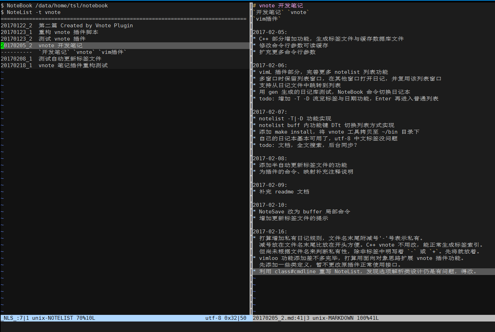

# vim 终端下的日记/笔记管理工具插件
`vnote` `git/readme`

## 简介

基于 Vim 编辑器的日记/笔记的插件工具。可方便地在 Vim 环境中新建、编辑笔记，以
及必要的浏览管理等工具。当日记量逐渐增多时，还提供一个用 C++ 写成的外部工具，
辅助生成索引等功用。

作者主要在 Linux 终端环境下完成。但纯 VimL 的基础插件部分应该不限平台。当以
utf-8 编码时，涉及中文的日记/笔记及标签也能正常处理。目前作者自己也正使用这个
工具写日记、记笔记，一些复杂功能将于后面逐渐增加。


主要功能：
* 日记/笔记就是普通 markdown 文本文件，可利用其他任何 markdown 插件及文本搜索
  工具。
* 默认笔记本在 `~/notebook` 目录下，新建的日记文件自动按日期与编号保存在
  `~/notebook/d/yyyy/mm/dd/yyyymmdd_n.md` 路径中（n 是 1, 2, 3 ...）。
* 笔记本目录可当作一个 git 仓库托管。私人日记在文件中后缀一个减号，即
  `yyyymmdd_n-.md`，可设定 `.gitignore` 规则忽略私人日记。
* 笔记支持标签系统，标签用反引号括起，支持子标签。在 `~/notebook/t` 子目录下自
  动生成标签索引文件。多层子标签类似目录路径层次处理。
* 支持笔记列表功能，可以按日期或标签列表。从列表中选定笔记打开相应文件编辑。支
  持多窗口，当存在多窗口时会在另一个窗口打开笔记文件。

## 安装

### VimL 插件部分直接安装

本 git 仓库符合标签 VimL 插件的目录结构。
依赖作者的另一个插件：[vimloo](https://github.com/lymslive/vimloo)。
如果已用任何插件管理工具，按相应的插件管理规范同时安装这两个插件即可。

也可以手动安装，先下载至本地，如 ~/.vim/bundle 目录：
```
$ cd ~/.vim/bundle
$ git clone https://github.com/lymslive/vimloo.git
$ git clone https://github.com/lymslive/vnote.git
```
然后在 vimrc 中手动将其加入 rtp (vim 的运行时搜索路径)：
```
let $VIMHOME = $HOME."/.vim"
set rtp+=$VIMHOME/bundle/vimloo
set rtp+=$VIMHOME/bundle/vnote
```

### C++ 工具部分编译安装

假设下载路径是 ~/.vim/bundle，则运行如下命令：
```
$ cd ~/.vim/bundle/vnote/src
$ make
$ make install
```

若成功执行，则将把一个名叫 `vnote` 的可执行文件复制到 ~/bin 目录下。假设该目录
已存在，且已自行加入系统的 PATH 环境变量中。

## 命令与快捷键参考

* `:NoteNew` 新建日记，按今天日期递增一个编号，若提供 `-` 参数则创建私有日记。
* `:NoteSave` （快捷键 `;w`），保存日记，光标在标签行中更新标签索引文件。
* `:NoteEdit` 按日期(`yyyy/mm/dd`格式)与编号参数打开日记，默认今天最大编号日记。
* `:NoteList` 打开日记列表，支持日期或标签参数，默认今天日期。
* `map <CR>` 在日记列表中回车，打开相应的日记文件，多窗口时在另一个窗口打开。
* `map <Space>` 在日记列中空格，展开一行，将该日记的标签也显示出来。
* `map <C-]> `在编辑日记文本中，跳转到日记列表，按标签或当天日期列表。

本插件的 VimL 代码实现都利用 vim 的自动加载机制放在 `autoload/` 目录下。
`plugin/` 与 `ftplugin/` 目录下的脚本只包含简单的命令与快捷键定义及注释。所以
建议直接阅读这两个目录下的脚本查找可用的命令与快捷键，文档更新可能难以保证。

* `plugin/vnote.vim` 定义了所有全局可用的命令(command)
* `ftplugin/notelist.vim` 定义了在日记列表窗口中可用的快捷键(map)
* `ftplugin/markdown.vim` 定义了在编辑日记文件时可用的快捷键(map)

如果发现某个快捷键不喜欢不习惯，或与其他插件有冲突？最简单的解决办法就是直接修
改这几个文件，替换其中某个自定义快捷键或命令。

## 更多参考链接

* [doc/tutor](doc/tutor.md) 一篇更详细的 vnote 日记玩转教程。
* [实例](https://github.com/lymslive/notebook)，笔者自己的笔记本目录，不定期更
  新同步。

## 致谢

* C++ 程序 vnote 在处理命令参数时，采用了 tanakh 提供的模板库，传送门：
https://github.com/tanakh/cmdline

